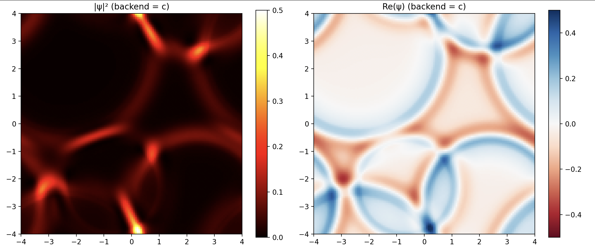

# Simulación de Ondas 2D

Simulador fisico de ondas 2D implementado con múltiples backends para comparación de performance.



## Características

- Simulación de ondas interactiva con visualización en tiempo real
- Múltiples implementaciones de backend:
  - Python puro
  - NumPy
  - C
  - C con AVX
  - C con Assembly
- Benchmarking para comparación de rendimiento

## Uso
Si no tenes instalado uv, instalar:
```
curl -LsSf https://astral.sh/uv/install.sh | less
```

Primero compilar las extensiones:
```bash
make
```

Ejecutar la simulación interactiva:
```bash
python main.py
```

Con un backend específico:
```bash
python main.py --backend <backend>
```

Backends disponibles:
- `python`: Python puro
- `numpy`: NumPy (default)
- `c`: Implementación en C
- `avx`: C con optimizaciones AVX
- `asm`: Assembly optimizado

Correr benchmarks:
```bash
make benchmark
```

## Resultados

Los benchmarks de rendimiento y análisis están disponibles en el directorio `results/` y el informe detallado en `informe/`.