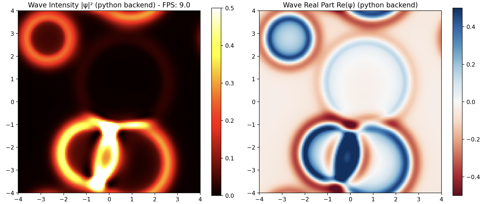

# Simulación de Ondas 2D

Simulador fisico de ondas 2D implementado con múltiples backends para comparación de performance.



## Características

- Simulación de ondas interactiva con visualización en tiempo real
- Múltiples implementaciones de backend:
  - Python puro
  - NumPy
  - C
  - C con AVX
  - C con Assembly
- Benchmarking para comparación de rendimiento

## Instalación y Uso

Instalar uv si no lo tenés:
```bash
curl -LsSf https://astral.sh/uv/install.sh | sh
```

Instalar dependencias y compilar extensiones:
```bash
uv sync
make
```

Ejecutar la simulación:
```bash
uv run python main.py
```

Con un backend específico:
```bash
uv run python main.py --backend <backend>
```

Con parámetros personalizados:
```bash
uv run python main.py --backend numpy --size 256 --wave-speed 3.0
```

Backends disponibles:
- `python`: Python puro
- `numpy`: NumPy (default)
- `c`: Implementación en C
- `avx`: C con optimizaciones AVX
- `asm`: Assembly optimizado

Parámetros adicionales:
- `--size`: Tamaño de la grilla de simulación (default: 128)
- `--wave-speed`: Velocidad de propagación de las ondas (default: 2.0)

Correr benchmarks:
```bash
make benchmark
```

## Resultados

Los benchmarks de rendimiento y análisis están disponibles en el directorio `results/` y el informe detallado en `informe/`.